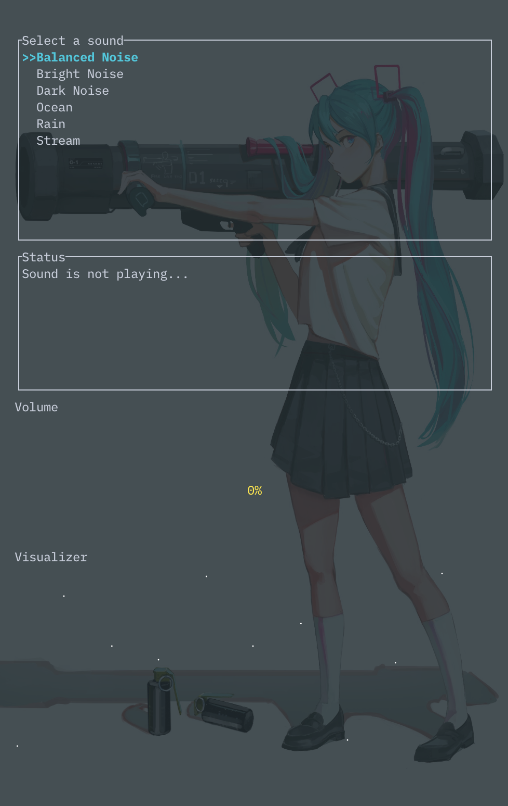

> **Notice: This project is currently a work in progress**

🚧 Oh, hello there! So you stumbled upon `bg-sound`, huh?

Well, I should probably address the quirks and known issues. Since it's just me tinkering away, things can get interesting. Here's what you should know:

Known issues:
- The visualizer widget? It's like modern art. Hard to understand and doesn't quite work as intended.
- Volume control? Mind of its own. It's an adventure trying to get it to behave.
- Oh, and the background sound? Doesn't actively change while the application is running. Because _Consistency is key around here._

But hey, if you're feeling up to the challenge, I won't stop you. Consider it a solo mission! And if you manage to fix something, I'll be eternally grateful.

Your contributions are always welcome! So, if you're up for it, check out the [Contributing Guidelines](https://github.com/spmfte/BG-Sounds/blob/main/CONTRIBUTING.md)

Now, I can't promise that everything will go smoothly, in fact I anticipate quite the opposite. I appreciate all and any future support, feedback, and contributions in making this project less quirky and more awesome.

If you encounter any additional quirks or just want to share your thoughts, [open an issue](https://github.com/spmfte/bg-sound/issues) or reach out to me.

---

# bg-sound

[](https://opensource.org/licenses/MIT)
[](https://travis-ci.org/your-username/bg-sound)
[](https://github.com/your-username/bg-sound/releases)
[](https://github.com/your-username/bg-sound/pulls)
[](https://github.com/your-username/bg-sound/graphs/commit-activity)
[](https://your-username.github.io/bg-sound)
[](https://www.rust-lang.org)
[](https://github.com/rust-unofficial/awesome-rust)

> Shortcuts to enable/disable background sounds on macOS

🎧🔊 bg-sound is a Rust CLI application designed for macOS to control background sounds easily. It provides a user-friendly interface in the terminal, allowing users to enable or disable background sounds with just a few keystrokes.

<p align="center">
  
</p>

## Features

- Simple and intuitive CLI interface
- Select from a variety of background sound options
- Control the volume of the background sounds
- Real-time visualization of sound data
- Easily toggle the status of background sounds

## Prerequisites

- Rust (nightly version recommended)
- macOS operating system

## Installation

To install `bg-sound`, follow these steps:

1. Clone the repository:

   ```bash
   git clone https://github.com/spmfte/bg-sound.git
   ```

2. Change to the project directory:

   ```bash
   cd bg-sound
   ```

3. Build the project using Cargo:

   ```bash
   cargo build --release
   ```

4. Run the executable:

   ```bash
   ./target/release/bg-sound
   ```

## Usage

Once you have installed `bg-sound`, you can use the following keyboard shortcuts to control the application:

- `j` or `k`: Move the selection up or down
- `u`: Increase the volume
- `d`: Decrease the volume
- `Enter`: Toggle the status of background sounds
- `Ctrl + C`: Quit the application

## License

This project is licensed under the MIT License. See the [LICENSE](LICENSE) file for details.

## Contributing

Contributions are welcome! Please check out the [Contribution Guidelines](CONTRIBUTING.md) for more information.

## Support

If you encounter any issues or have any questions, feel free to [open an issue](https://github.com/spmfte/bg-sound/issues) or reach out to us.
